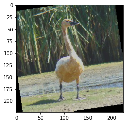

# What Bird? An Exploration by Rachel Phuong

## What's Going On
Image classification: to put it shortly, given images of birds, my goal was to 
properly identify, or classify, the type of bird. Using the data set given by 
[the Kaggle competition](https://www.kaggle.com/c/birds21sp), I wanted to 
explore the various parameters, model modifications, and data augmentations 
that could be done to improve the accuracy of the convolutional neural network 
for this bird dataset.

### Video

(Click the image to open on YouTube)

## Where I Started
Honestly, I just wanted to know why the things we were learning worked and try 
them out for myself. Basing my code off of the [tutorial given by Prof. Redmon](https://colab.research.google.com/drive/1kHo8VT-onDxbtS3FM77VImG35h_K_Lav?usp=sharing),
I wanted to see whether tweaking ResNet18 would give drastically different 
results. Although I could have tried other models, I wanted to stick with one 
model as to not extremely increase the complexity of the project.

As for the data, I had started with having pytorch resize the data in the 
transforms. However, I discovered that this would take a very long time, so I
switched to pre-resizing the data before passing it to the dataloader. 
I chose to have two separate sizes, 128 pixels and 224 pixels.

## What I Tried and What Happened
Below, I have summarized the various experiments or modifications I made and 
what I found from them. To see the related code, please see the notebook [Phuong_Bird_Classifier.ipynb](https://github.com/rphuong/birds/blob/main/Phuong_Bird_Classifier.ipynb).

### Setting Up the Learning
First, I needed to find a good model and learning rate.

#### Freezing Layers of ResNet
With the help of [this discussion post](https://discuss.pytorch.org/t/finer-control-for-freezing-layers-in-resnet/10445),
I tried training on all layers and then training on only the final layer. 
Both resulted in low accuracies below 55%. I decided that to get the best of 
both, I would proceed by only unfreezing the last sequential section and 
everything after that. That way, the weights that are most directly related to 
ImageNet are retrained for this bird dataset. 

#### Learning Rate
I wanted to find the learning rate which would have the most decrease in loss. 
I started with a rate of 0.1 and changed the rate by +/-0.01 or +/-0.02 
to see how the loss would change. Then I took the rate which had 
the smallest final loss to be the best learning rate. The table below shows the 
final lowest losses for the various learning rates after training for 1 epoch.
|Rate|0.12 |0.10 |0.08 |0.06 |0.05 |0.04 |0.03     |0.02 |
|----|-----|-----|-----|-----|-----|-----|---------|-----|
|Loss|3.228|3.146|3.165|3.162|3.115|3.010|**2.942**|3.067|

### Reducing Overfitting
Next, I wanted to reduce the overfitting of the model to the training set. At 
this point, the model was at 97.8% training accuracy but only 66.5% testing
accuracy. 

#### Dropout
After researching a bit about overfitting, I discovered that you can add noise
by dropping some of the nodes in the network. Therefore, I added a dropout 
layer before the final linear layer of the network. This resulted in a 1.1% 
testing accuracy increase (66.5% to 67.6%). 

#### Increasing Weight Decay
This was a small test of doing the same 5 epochs but with double the decay. I 
was expecting some improvement in the testing accuracy, but it actually dropped 
0.5% (67.8% to 67.3%). The learning could have been slowed down due to adding 
more decay when there was already dropout. 

#### Data Augmentation
To start off, the only data augmentation I had was random cropping and random 
horizontal flipping. However, the model was still overfitting, so I decided to 
add some more augmentation: random rotation and color jitter (i.e. adjusting
brightness, contrast, saturation and hue). I did not change the hue,
because I was afraid that a bird could be classified incorrectly (e.g. training
with a pink-hue swan resulting in a flamingo being classified as such). Below 
you can see the difference in images before and after the added data augmentation. 
Original            |With Crop and Flip | With Crop, Flip, Color Jitter, and Rotation
:-------------------------:|:-------------------------:|:-------------------------:
  ||

The results were interesting. The accuracy of the training set grew
more slowly, and the testing accuracy was now 66.9% instead of the prior 67.8%.
Without adding color jitter, it also performed better with an accuracy of 67.5%.
This may be because the changes in the color may be obscuring the features in
a way not intended. However, the color jitter was still helping the overfitting.

The table below compares the training and testing accuracy for the various 
experiments.
Experiment|No Dropout|Dropout|Weight Decay|Rotation|Rotation & Color
----------|----------|-------|------------|--------|----------------
Training  |97.8      |94.8   |94.7        |90.3    |84.2
Testing   |66.5      |67.8   |67.3        |67.5    |66.9
Difference|31.3      |27.0   |27.4        |22.8    |17.3

In the end, the best testing accuracy was at 68%. The model had dropout and
rotation but no color changing. 

## What I Learned and What's Next
While working on this project, I learned that there's no one way to get the 
results that I want. Tuning the model takes work and constant testing of 
modifications. I could compare results for individual modifications, but 
comparing across multiple modifications was more difficult. I only made one 
change at a time and couldn't have all combinations of modifications.
However, I felt like the testing of the learning rate, dropout, and 
data augmentation really helped to get the model where it is now. 

In the future, I would like to explore how to
- Split the training set into a training and validation set while also
maintaining the train/val ratio for each class
- Test unfreezing more layers, but still not all of them
- Add dropout into the intermediate layers of the model while still being able
to use the pretrained weights
- Modify other pretrained models (e.g. ResNet50, Inception) and compare the
results to ResNet18.
